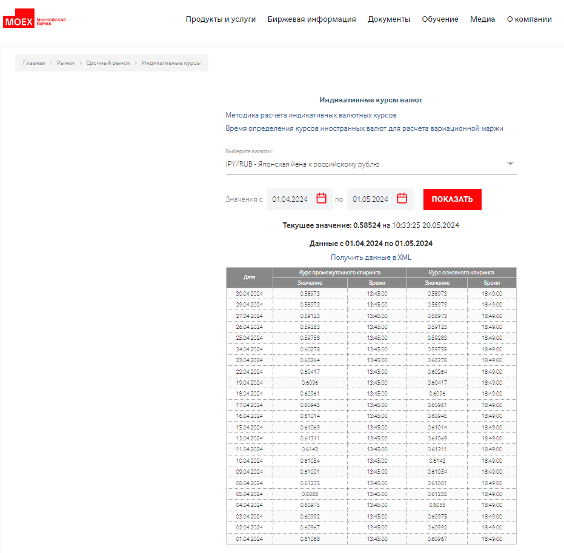

# Тест от GreenAtom
### Цель проекта: парсинг страницы с сайта moex.com, создание таблицы Excel и отправка себе на почту
main - основная прграмма. Пакет Services предоставляет вспомогательные модули: table_extractor.py, excel_creator.py, mailer.py
Вид целевой страницы с таблицей данных:

